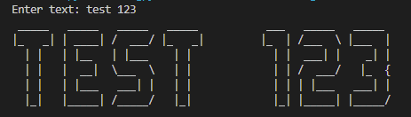

# ASCII-text-art

Prints ASCII text art of the user's entered string. Works with letters (A-Z), numbers (0-9), and spaces. See the below example.

Currently prints to the console - will be updated to write to a file or display on a web page in the future.

## Example

